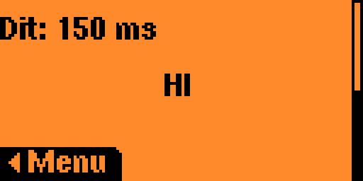
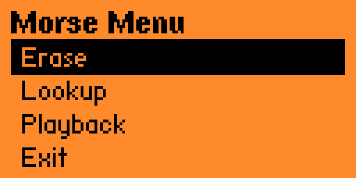

# Morse Code Plus

Enhanced Morse Code parser and playback application for the **Flipper Zero**.




---

## Features
- Live Morse keying with adjustable **volume** and **Dit length**
- **Menu system** with:
  - **Erase** – clear current buffer
  - **Lookup** – scroll through A–Z, 0–9 and see corresponding Morse code
  - **Playback** – play back full message in Morse
  - **Exit**
- Real-time visual feedback and tone output
- Cancel playback with **Back** button
- Lookup / insert characters

---

## Controls
**Main screen**
- **Up/Down** – adjust volume  
- **Left/Right** – adjust Dit (dot) length in ms  
- **OK** – press to key Dit / release to stop  
- **Back** – open menu / hold to exit app 

**Menu**
- **Up/Down** – navigate options  
- **OK** – select  
- **Back** – return to main  

**Lookup**
- **Up/Down** – scroll letters/numbers  
- **OK** – add symbol to buffer  
- **Right** – play symbol tone  
- **Back** – return to menu  

---

## Building
From the firmware root:

```bash
./fbt fap_morse_code_plus
```

The compiled `.fap` file will appear in:

```
build/f7-firmware-D/.extapps/
```

Copy it to your Flipper Zero `apps/` folder to install.

---

## Requirements
- Tested for Flipper Zero Firmware 1.3.3-rc (fw 86)  
- FBT build system (`./fbt`)  

---

## Credits
Based on the original **Morse Code** application by @wh00hw, extended with lookup mode, volume/delay control, and playback cancellation.  
Developed by **a26blass**.
